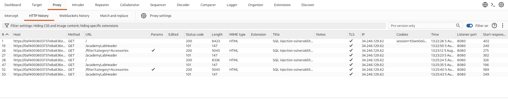

<h1>SQL injection vulnerability in WHERE clause allowing retrieval of hidden data</h1>

Difficulty : Apprentice

Link : https://portswigger.net/web-security/learning-paths/sql-injection/sql-injection-retrieving-hidden-data/sql-injection/lab-retrieve-hidden-data


<h2>Lab Objective</h2>

This lab contains a SQL injection vulnerability in the product category filter. When the user selects a category, the application carries out a SQL query like the following:

SELECT * FROM products WHERE category = 'Gifts' AND released = 1
To solve the lab, perform a SQL injection attack that causes the application to display one or more unreleased products.

<h2>Solution</h2>

<b>I am going to use Burp Suite community edition for this project</b>

In burp Suite, at the proxy tab, with the intercept off, I am going to open browser where I will be directed to chromium which is the inbuilt browser for burp Suite. 


I will paste the link to the portswigger lab in chromium.

At the http history section, I will highlight the link I just opened on my browser, right click and click send it to the repeater where I can better analyse it.



At the repeater section I will play around with the different queries to look for any anomalies.

Adding a single quote gives me a "500 internal server error" which means that the website is not properly configured to handle input before passing it to the backend.


Knowing that the website has anormalies, I am going to try and display all the categories of products at once including the unreleased ones using this -- combines with the boolean condition OR 1=1. 

The -- is a comment indicator in SQL and hence the rest of the query is going to be commented out and ignored.

```markdown
' OR 1=1-- 
```

This solves the challenge because it displays all products including the unreleased ones which is what the lab was testing


