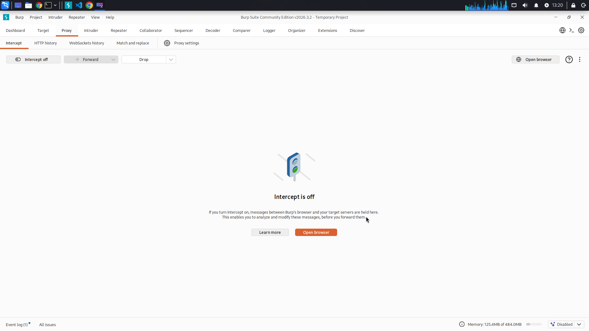
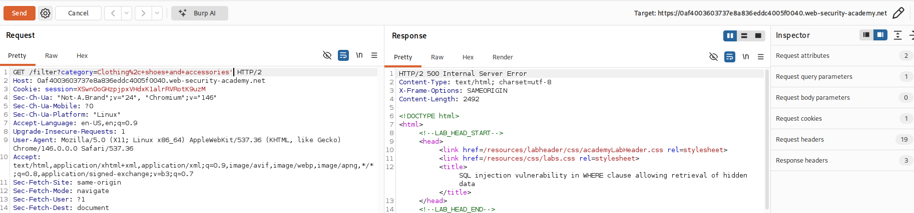
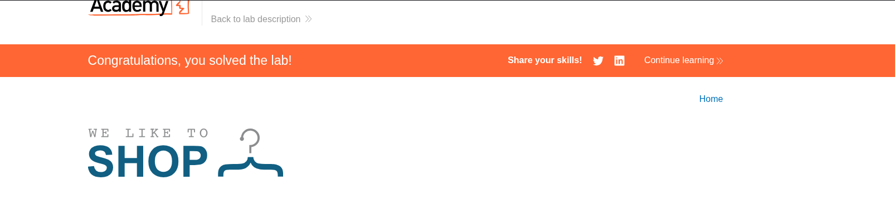
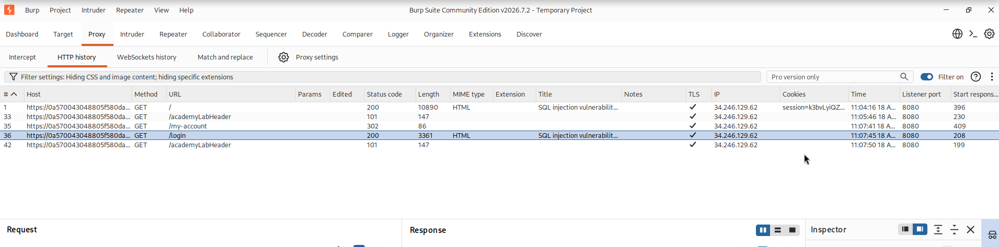

# SQL INJECTION

## 1. SQL injection vulnerability in WHERE clause allowing retrieval of hidden data

Difficulty : Apprentice

Link : https://portswigger.net/web-security/learning-paths/sql-injection/sql-injection-retrieving-hidden-data/sql-injection/lab-retrieve-hidden-data


### Lab Objective

This lab contains a SQL injection vulnerability in the product category filter. When the user selects a category, the application carries out a SQL query like the following:

SELECT * FROM products WHERE category = 'Gifts' AND released = 1
To solve the lab, perform a SQL injection attack that causes the application to display one or more unreleased products.

### Solution

**I am going to use Burp Suite community edition for this project
**
In burp Suite, at the proxy tab, with the intercept off, I am going to open browser where I will be directed to chromium which is the inbuilt browser for burp Suite. 



I will paste the link to the portswigger lab in chromium.

At the http history section, I will highlight the link I just opened on my browser, right click and click send it to the repeater where I can better analyse it.


At the repeater section I will play around with the different queries to look for any anomalies.

Adding a single quote gives me a "500 internal server error" which means that the website is not properly configured to handle input before passing it to the backend.



Knowing that the website has anormalies, I am going to try and display all the categories of products at once including the unreleased ones using this -- combines with the boolean condition OR 1=1. 

The -- is a comment indicator in SQL and hence the rest of the query is going to be commented out and ignored.

```markdown
' OR 1=1-- 
```

This solves the challenge because it displays all products including the unreleased ones which is what the lab was testing




## 2. SQL injection vulnerability allowing login bypass


### Lab Objective
This lab contains a SQL injection vulnerability in the login function.

To solve the lab, perform a SQL injection attack that logs in to the application as the administrator user.


### Solution
Normally, when an application asks you to log in and insert your user name and password, it check the credentials by performing this SQL query

SELECT * FROM users WHERE username = 'wiener' AND password = 'bluecheese'

But if a user can find a way of not having the password checked and only the username is checked they will be able to login. This can be done by commenting out the password section of the query.

I am going to use Burpsuite community edition for this task as I did in the first lab.


I will start by sending the login page to the repeater from th eproxy page



The raw code rendedred did not show me the username and password section of the page, the trick here its to try and login using an incorrect password with ht eadministrator username so that you can be able to see it on the Burpsuitee's side.

You will see a similiar line of code at the bottom of the page 

csrf=0LiALJSmPVUypAFxlyDfkN2rVoWE6aiz&username=administrator&password=12345

Here, we are going to comment out the password section so that we can login using only the username by using the below code.


### Rough notes

Imagine an application that lets users log in with a username and password. If a user submits the username wiener and the password bluecheese, the application checks the credentials by performing the following SQL query:

SELECT * FROM users WHERE username = 'wiener' AND password = 'bluecheese'

In this case, an attacker can log in as any user without the need for a password. They can do this using the SQL comment sequence -- to remove the password check from the WHERE clause of the query. For example, submitting the username administrator'-- and a blank password results in the following query:

SELECT * FROM users WHERE username = 'administrator'--' AND password = ''
This query returns the user whose username is administrator and successfully logs the attacker in as that user.


### Lab Objective

### Solution


### Lab Objective

### Solution


### Lab Objective

### Solution


### Lab Objective

### Solution
